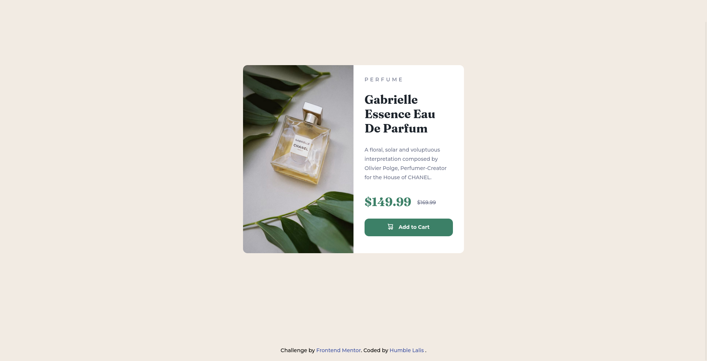

# Frontend Mentor - Product preview card component solution

This is a solution to the [Product preview card component challenge on Frontend Mentor](https://www.frontendmentor.io/challenges/product-preview-card-component-GO7UmttRfa). Frontend Mentor challenges help you improve your coding skills by building realistic projects. 

## Table of contents

- [Overview](#overview)
  - [The challenge](#the-challenge)
  - [Screenshot](#screenshot)
  - [Links](#links)
- [My process](#my-process)
  - [Built with](#built-with)
  - [What I learned](#what-i-learned)
- [Author](#author)

## Overview

### The challenge

Users should be able to:

- View the optimal layout depending on their device's screen size
- See hover and focus states for interactive elements

### Screenshot

### Links

- Solution URL: [Github](https://github.com/humbl3lalis/frontend_mentor_product_review_card_component.git)
- Live Site URL: [Vercel](https://frontend-mentor-product-review-card-component-solution.vercel.app/)

## My process
I use CSS grid and flexbox together to be responsive
And I used Responsive images with <picture> and <source> HTML element

### Built with

- Semantic HTML5 markup
- Responsive Images
- CSS custom properties
- Flexbox
- CSS Grid
- Mobile-first workflow

### What I learned

Usage of CSS Responsive Images

## Author

- Frontend Mentor - [@humbl3lalis](https://www.frontendmentor.io/profile/humbl3lalis)

